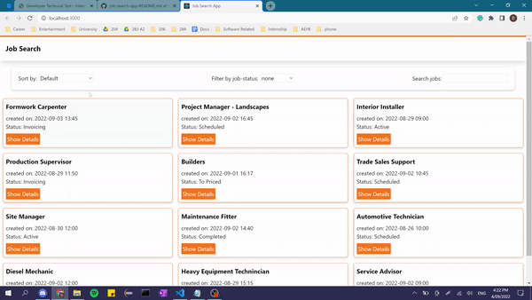

# Job Search App

<h4>Simulation of a job search app, allowing a tradie to see their jobs.</h4>

<h2>Tech Stacks</h2>
<h4>This application focuses on the front-end part, made with typescript react and tailwind. I used, a JSON file to list the jobs which more jobs can be added or removed if needed. <a href="https://github.com/TylerDonghwi/job-search-app/blob/main/src/data/jobs.json" target="blank">(link to JSON file in the repo)</a></h4>

  

<h2>Display</h2>
<h4>By default, it displays the general informations like title, creation date and time and the status of each job. Also the application is responsive depending on the media.</h4>

<h5>Main Screen</h5>

<h5>Half Screen</h5>

<h5>Small Screen</h5>

<h2>Sorting, Filtering and Searching</h2>
<h4>Users can sort (either by alphabettically or by dates), filter (by the job status) or search the jobs (by the title of the job).</h4>

<h5>Sorting</h5>

<h2>Job Information, Changing Job Status and Notes</h2>
<h4>User can click the button to see the details of the job and user can change job status, make notes, edit or remove existing notes on the job.</h4>

<h2>Local Storage</h2>
<h4>The job status and the notes are stored in the localstorage of the browser, allowing users to come back and see their previous notes and check the job statuses.</h4>
